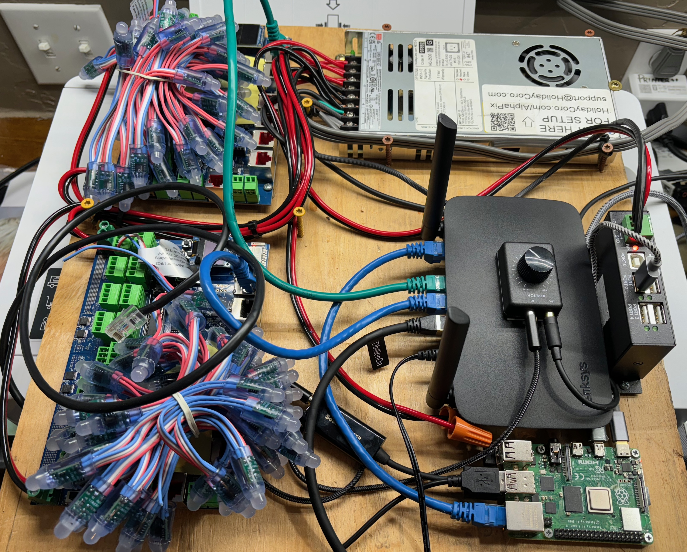

# FerrisWheel

## Design

Orchestration of lighting and music is controlled by a single [Raspberry Pi CPU](https://www.raspberrypi.com/products/raspberry-pi-4-model-b/) and two (maybe 3) [F16v5 lighting controllers](https://pixelcontroller.com/store/featured/88-f16v5.html). 

## Design

## IT Architecture

All computing devices connect to the `FerrisNetwork` Wifi WAP on the float base as follows:

ß

## Network IPs

### Wired Ethernet Static IPs (for initial configuration)

- Pi: `192.168.10.10`
- Controller A: `192.168.10.20`
- Controller B: `192.168.11.30`

### WiFi (for production)

- Pi: `192.168.10.11`
- Controller A: `192.168.10.21`
- Controller B: `192.168.10.31`

### Last Resort Access WiFi (for access debugging)

- Controller A: WiFi `Falcon_F16V5_67A1`, IP address `192.168.8.1`
- Controller B: WiFi `Falcon_F16V5_F9E9`, IP address `192.168.8.1`

