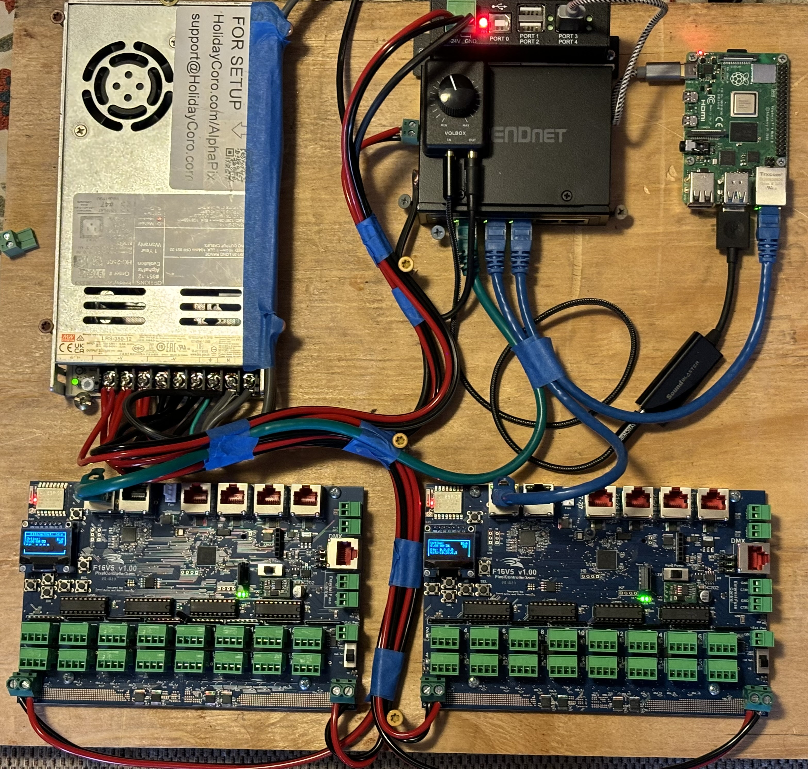

# FerrisWheel

## Design

Orchestration of lighting and music is controlled by a single [Raspberry Pi CPU](https://www.raspberrypi.com/products/raspberry-pi-4-model-b/) and two [F16v5 lighting controllers](https://pixelcontroller.com/store/featured/88-f16v5.html). 

## Design

## IT Architecture

There are two independent controllers on the float.

Controller A, also called 'wheel' is F16v5 Pixel Controller running in independent player mode.
This controller drives the spiral light strings on the outside edges of the Ferris wheel, and the lights on the presents around the edge of the wheel.

Controller B, AKA 'base' has a Raspberry Pi driving an F16v5 pixel controller.
Controller B outputs the music, and controls the 5 light strings circling the 'tree' at the front of the float, 
the star atop the tree, 
and periphery lighting at the base of the float.

ß

## Network IPs

### Wired Ethernet Static IPs (for show development)

- Controller A: `192.168.10.20`
- Raspberry Pi Player: `192.168.10.10`
- Controller B: `192.168.10.30`

### ~WiFi Static IPs (for show timing)~

- ~Controller A: `192.168.10.21`~
- ~Controller B: `192.168.10.31`~

### ~Last Resort Access WiFi IPs (for access debugging)~

- ~Raspberry Pi Player: WiFi `FPP`, IP address `192.168.8.1`~
- ~Controller A: WiFi `Falcon_F16V5_67A1`, IP address `192.168.8.1`~
- ~Controller B: WiFi `Falcon_F16V5_F9E9`, IP address `192.168.8.1`~

